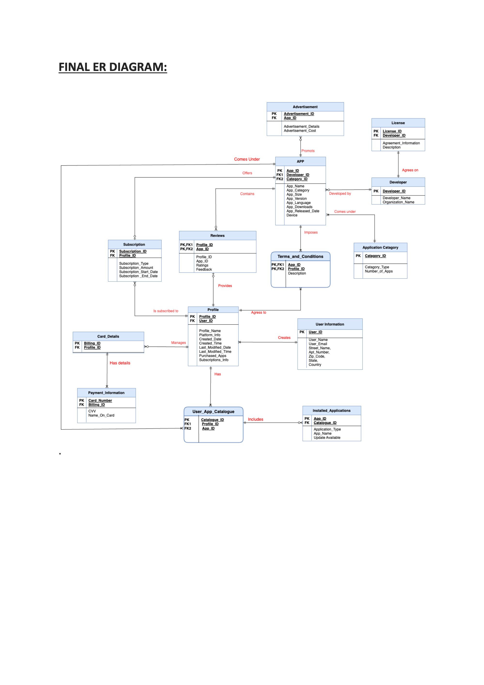

# 📱 App Store Management System

## 🚀 Project Overview
The **App Store Management System** is a comprehensive solution designed to manage applications across various platforms efficiently. The App Store categorizes applications based on genres such as Art & Design, Social Media, E-Books, Entertainment, Finance, Food & Drinks, Health & Fitness, Maps, and more. It provides users with an intuitive interface to install, uninstall, and update applications, as well as to provide reviews and ratings. Companies can also use this interface to launch their applications and gather user feedback.

## 🌐 Background
In the digital era, the smartphone industry is rapidly growing, transforming how we live, communicate, work, shop, travel, and entertain ourselves. The App Store is a personalized hub that simplifies these aspects by providing a platform where users can access various applications tailored to their needs. For companies, it offers an opportunity to reach a broad audience by developing and distributing software applications.

## 🎯 Mission Statement/Objectives
The App Store Management Database System aims to serve as a centralized, robust, and efficient system where applications are integrated seamlessly from both a user's and a company's perspective. Key objectives include:
- **User Accessibility**: Enable users to easily find, install, and manage applications.
- **Feedback Mechanism**: Allow users to review and rate applications, providing valuable feedback to developers.
- **Company Integration**: Provide companies with tools to upload, update, and manage their applications, and access user feedback.

## 🗂️ Primary Entities
### 👤 Users
- **Functions**: View, install, uninstall, and review applications.
- **Attributes**: UserID, Name, Email, Device, Payment Information, etc.

### 🏢 Companies
- **Functions**: Add, delete, update apps, and access user feedback.
- **Attributes**: CompanyID, Name, Address, Contact Information, etc.

### 📱 Apps
- **Functions**: Central entity of the system, containing detailed information about each app.
- **Attributes**: AppID, Name, Genre, Release Date, Chart Position, Compatible Devices, Downloads, Developer, Version, Size, etc.

### 🧾 Accounts
- **Functions**: Manage user information and payment details.
- **Attributes**: AccountID, UserID, Payment Information, Subscription Details, etc.

## 📊 Database Design

### Entity-Relationship Diagram
The ER diagram provides a visual representation of the database structure and relationships between entities. Significant modifications include:
- **User App Catalogue**: Now an associative entity linking App and Profile.
- **Card Details**: Normalized into `Name_on_card` and `CVV`.
- **User Information**: Address split into `Street Name`, `Apt_Number`, `Zip_Code`, `State`, and `Country`.
- **Advertiser and Developer**: Advertisement is now a strong entity, removing the "Advertises" relationship.
- **App and Reviews**: Ratings removed from the App entity to avoid redundancy.
- **App**: Attribute `age` renamed to `Release_date`.




## 📂 Project Files
### DDL (Database Object Creation Statements)
- **Description**: Contains SQL statements to create database schema, including tables, constraints, and relationships.
- **Usage**: Run these statements in your database management system to set up the initial database structure.

### DML (Insert SQL Statements)
- **Description**: Includes SQL statements to insert initial data into the database tables.
- **Usage**: Execute these statements to populate your database with sample data for testing and development.

### SQL Queries
- **Description**: A collection of SQL queries to perform various operations and retrieve data from the database.
- **Usage**: Use these queries to interact with the database, perform CRUD operations, and generate reports.

## 🛠️ How to Use
1. **Clone the Repository**
   ```bash
   git clone https://github.com/your-username/your-new-repo.git
   cd your-new-repo
   

2. **Run DDL Scripts**
Execute the DDL script to create the database schema.
  ```sql
  -- Example command to run DDL script
  source path_to_ddl_script.sql;
  ```

3. **Run DML Script**
Execute the DML script to populate the database with initial data.
```sql
-- Example command to run DML script
source path_to_dml_script.sql;
```
4. **🗃️ Running Queries **
   ```sql
   -- Example command to run DML script
    source path_to_dml_script.sql;
   ```
## 📜 License
This project is licensed under the MIT License - see the [LICENSE](LICENSE) file for details.

## 🙏 Acknowledgements
Special thanks to our instructors and teaching assistants for their guidance and support throughout this project.


